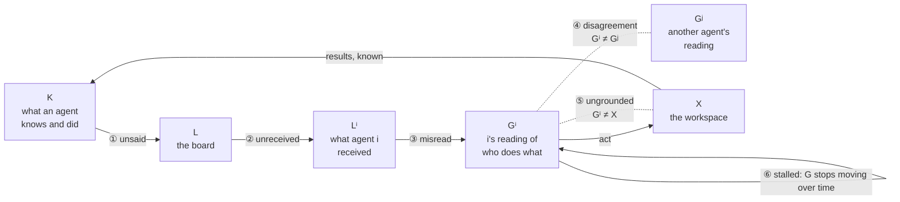

# taxonomy-choices

There is one catalog of failure patterns, and there are several ways to group it. Annotators pick a grouping. Nothing is defined twice.

| File | What it holds |
|---|---|
| [patterns.json](patterns.json) | every pattern, once: id, name, kind, a definition a person can label with, an example, its MAST counterparts |
| [ten_modes.json](ten_modes.json) | the comms-failure paper's ten modes, in three groups. The reference; it covers ten patterns, on purpose |
| [state_gap.json](state_gap.json) | **Proposal A**: classes by which two states of the run disagree. Complete |
| [decision_point.json](decision_point.json) | **Proposal B**: classes by which decision an agent got wrong. Complete |

An annotator names its choice in one line, `taxonomy = "state_gap"`, and reports pattern ids. Every choice groups the same patterns, so one set of labels reads under every choice:

```python
from commsfail.annotators.taxonomy import regroup
regroup({"R1": 2, "D1": 3, "stale_act": 1}, "state_gap")   # {"misread": 2, "ungrounded": 3, "unreceived": 1}
```

```bash
commsfail taxonomy                       # the choices, with their classes, patterns and completeness
commsfail taxonomy state_gap             # one choice, resolved against the catalog
commsfail audit export ... --codebook state_gap          # people label patterns
commsfail audit export ... --codebook state_gap:groups   # or only the classes: fewer, coarser decisions
```

## Each pattern has a kind

| Kind | Meaning |
|---|---|
| `missing` | something that should happen does not |
| `wrong` | it happens, but wrongly |
| `timing` | it happens too early, too late, or on an old version |
| `excess` | it happens more than needed |

The kind is a second axis, which any choice can cross with its classes.

## Proposal A: `state_gap`

A run has states:
- **K**: what each agent knows and has done;
- **L**: the board;
- **Lⁱ**: what agent *i* has received;
- **Gⁱ**: *i*'s reading of who does what;
- **X**: the workspace.

Coordination moves around one cycle: agents say, the board delivers, agents read, agents act. A failure is classed by the step of the cycle where two states stop agreeing.



| Class | Between | Family | Condition | Evidence | What can remove it |
|---|---|---|---|---|---|
| ① unsaid | K → L | liveness | disclosure | the agent's own log has it; the board does not | nothing can force it; a board can prompt and expose it |
| ② unreceived | L → Lⁱ | safety | C0 currency | `wakes.ndjson` against `room.ndjson` | delivery, and a notice when a post supersedes one in use |
| ③ misread | Lⁱ → Gⁱ | safety | C1 retention, both directions | the agent's next act contradicts what it received | projection |
| ④ disagreement | Gⁱ ≠ Gʲ | safety | C2 agreement | two agents act on incompatible readings of the same posts | naming, and acts that state what the work is |
| ⑤ ungrounded | Gⁱ ≠ X | safety | C3 grounding | each seat's own log and the checks against its claims | check |
| ⑥ stalled | G over time | liveness | progress and closure | the sequence of acts: no progress, a waiting cycle, items open at the end | nothing can force it; a board can expose it |
| overhead | — | cost | — | posts and commands that change nothing | none needed; measure it |

The two families split along what a board can promise:
- **safety** (②–⑤): the board can make sure nothing false is believed;
- **liveness** (① and ⑥): the board can only show that something good has not happened yet.

Out of scope, by name:
- `anchoring`: every state agrees, and the team simply chose badly;
- `injection`: adversarial.

Failures of capability, where the work is coordinated correctly and is still wrong, are not communication failures at all.

## Proposal B: `decision_point`

A failure is classed by the decision an agent got wrong in the life of a piece of work. Each class is one decision, and so one training target.

| Class | The decision |
|---|---|
| disclose | whether to put a need, a fact or a result on the board |
| claim | whether to take a piece of work, and whether it is free |
| specify | what exactly the work is, and when it is done |
| hand off | passing inputs and results on, at the right version and time |
| report and verify | when to say it is done, and whether to check another's claim |
| progress and close | whether to keep discussing, start, wait or stop |
| overhead | — |

## Adding to the catalog or the choices

1. **A new pattern.** Add it to `patterns.json` with an id, a name, a kind, a definition, an example and its MAST counterparts. Then place it in **every complete choice**, in a class or in `out_of_scope` with a reason. `pytest` fails until you have, and names the choice. That is the completeness check: a taxonomy that says it is complete has to say where every known failure goes.
2. **A new choice.** Add a `<name>.json` with its groups, a `modes` map from pattern id to group, and, if you mark it `complete`, an `out_of_scope` map. It is then listed, checked, and usable as a codebook.
3. **Changing a definition** changes the catalog's `version`, because labels made under the old wording no longer compare with the new.
